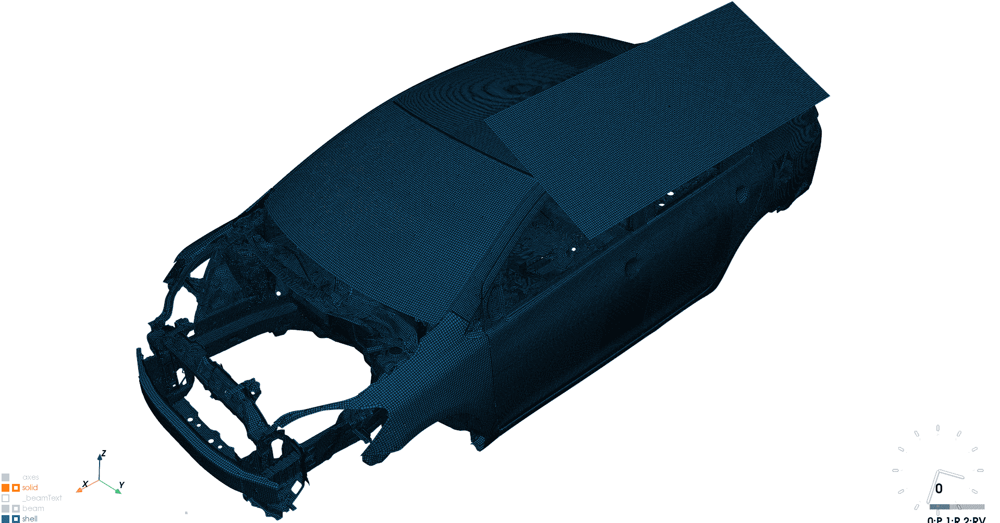
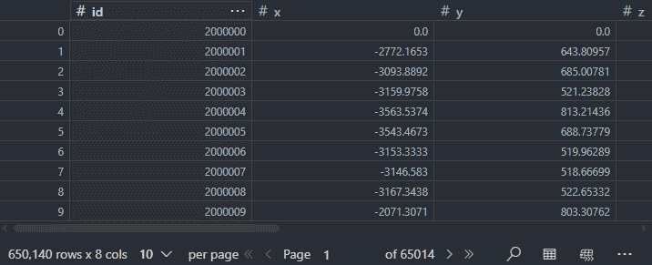
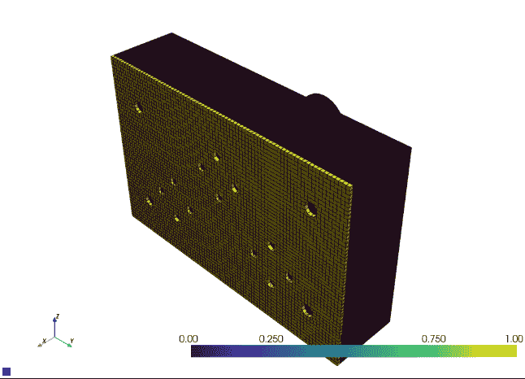
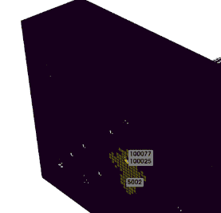
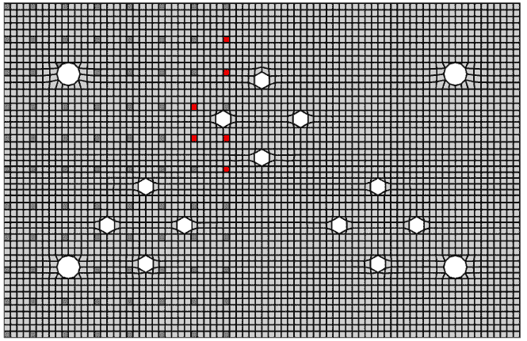
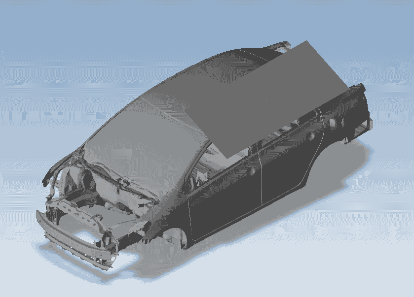
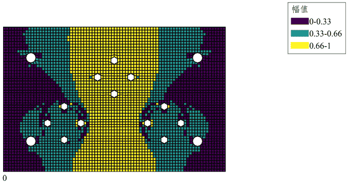
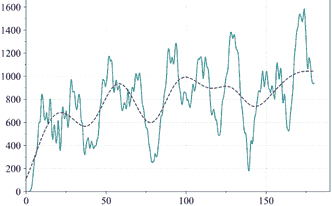

DYNA前后处理、可视化及自动优化求解

- 示例k文件来源：[Yaris Dynamic Roof Crush](https://www.dynaexamples.com/implicit/Yaris Dynamic Roof Crush)

- ```python
  j = bl_keyfile("000_yaris_dynamic_roof_crush_01.k")
  j.show()
  ```

  

  ```python
  j
  ```

  ```
  LsDynaEntity with:
      *NODE:                                                            650140
      *ELEMENT_SOLID:                                                   1805
      *ELEMENT_SHELL:                                                   648025
      *ELEMENT_BEAM:                                                    4129
      *PART:                                                            17
      *DEFINE_CURVE:                                                    21
      *SET_NODE_LIST:                                                   211
      *SET_PART_LIST:                                                   4
    Entities:                                                           73
      *KEYWORD:                                                         1
      *PARAMETER:                                                       1
      *DEFINE_TRANSFORMATION:                                           1
      *INCLUDE_TRANSFORM:                                               1
      *MAT_PIECEWISE_LINEAR_PLASTICITY:                                 504
      *MAT_ELASTIC:                                                     10
      *MAT_MODIFIED_PIECEWISE_LINEAR_PLASTICITY:                        6
      *MAT_LOW_DENSITY_FOAM:                                            2
      *MAT_SPOTWELD:                                                    1
      *MAT_SPRING_ELASTIC:                                              1
      *MAT_DAMPER_VISCOUS:                                              2
      *MAT_SPRING_NONLINEAR_ELASTIC:                                    1
      *SECTION_BEAM:                                                    1
      *SECTION_DISCRETE:                                                1
      *SECTION_SHELL:                                                   2
      *SECTION_SOLID:                                                   1
      *PART_CONTACT:                                                    512
      *PART:                                                            17
      *NODE:                                                            650140
      *ELEMENT_SOLID:                                                   1805
      *ELEMENT_SHELL:                                                   648025
      *ELEMENT_BEAM:                                                    4129
      *ELEMENT_MASS:                                                    1
      *DEFINE_CURVE:                                                    21
      *CONSTRAINED_JOINT_REVOLUTE_ID:                                   1
      *CONSTRAINED_NODAL_RIGID_BODY:                                    210
      *SET_NODE_LIST:                                                   211
      *CONSTRAINED_SPOTWELD:                                            1
      *CONTACT_TIED_SHELL_EDGE_TO_SURFACE_ID_BEAM_OFFSET:               1
      *SET_PART_LIST:                                                   4
      *CONTACT_TIED_SHELL_EDGE_TO_SURFACE_ID:                           1
      *CONTACT_AUTOMATIC_SINGLE_SURFACE_MORTAR_ID:                      1
      *INCLUDE:                                                         2
      *MAT_RIGID:                                                       1
      *DEFINE_COORDINATE_NODES:                                         1
      *CONSTRAINED_RIGID_BODIES:                                        1
      *CONTROL_ACCURACY:                                                1
      *CONTROL_BULK_VISCOSITY:                                          1
      *CONTROL_CONTACT:                                                 1
      *CONTROL_ENERGY:                                                  1
      *CONTROL_HOURGLASS:                                               1
      *CONTROL_IMPLICIT_GENERAL:                                        1
      *CONTROL_IMPLICIT_SOLUTION:                                       1
      *CONTROL_IMPLICIT_SOLVER:                                         1
      *CONTROL_MPP_IO_NODUMP:                                           1
      *CONTROL_OUTPUT:                                                  1
      *CONTROL_SHELL:                                                   1
      *CONTROL_SOLID:                                                   1
      *CONTROL_SOLUTION:                                                1
      *CONTROL_TIMESTEP:                                                1
      *CONTROL_TERMINATION:                                             1
      *DATABASE_ABSTAT:                                                 1
      *DATABASE_DEFORC:                                                 1
      *DATABASE_ELOUT:                                                  1
      *DATABASE_GLSTAT:                                                 1
      *DATABASE_JNTFORC:                                                1
      *DATABASE_MATSUM:                                                 1
      *DATABASE_NODOUT:                                                 1
      *DATABASE_RBDOUT:                                                 1
      *DATABASE_RCFORC:                                                 1
      *DATABASE_SBTOUT:                                                 1
      *DATABASE_SLEOUT:                                                 1
      *DATABASE_BINARY_D3PLOT:                                          1
      *DATABASE_EXTENT_BINARY:                                          1
      *DATABASE_FORMAT:                                                 1
      *CONTROL_IMPLICIT_AUTO:                                           1
      *CONTROL_IMPLICIT_DYNAMICS:                                       1
      *BOUNDARY_PRESCRIBED_MOTION_SET:                                  1
      *BOUNDARY_PRESCRIBED_MOTION_RIGID_LOCAL:                          1
      *LOAD_BODY_Z:                                                     1
      *CONTACT_AUTOMATIC_SURFACE_TO_SURFACE_MORTAR_ID:                  1
      *TITLE:                                                           1
      *END:                                                             1
  ```


### dyna输入文件*.k解析

为求解器输入文件提供面向对象的关键字字段解析、编辑、格式规范、相依性查询方法

- k文件可以是标准格式 long I10
- 可以包含include关键字
- 通过自定义字段字典显式设置，为关键字对象提供按位置索引和按字段索引/修改方法
- 可以写出为新的.k文件，但会删除所有注释行


关键字收集器

- ```
  j.nodes['*NODE']
  ```

  

拓扑信息的相依性

- ```
  get_related_elems()
  ```

查询关键字字段

- ```python
  len(j.keywords['*MAT_ELASTIC'])
  j.keywords['*MAT_ELASTIC'][0]
  ```

  ```
  0---------1---------2---------3---------4---------5---------6---------7---------
  --------------------------------------------------------------------------------
  *MAT_ELASTIC
     2000006   7.89E-9  200000.0       0.3       0.0       0.0       0.0
  --------------------------------------------------------------------------------
  ```

  按字段

  ```python
  j.keywords['*MAT_ELASTIC'][0]['MID'] # '   2000006'
  ```

  按位置

  ```python
  j.keywords['*MAT_ELASTIC'][0][0]   # '   2000006' # 行
  j.keywords['*MAT_ELASTIC'][0][0,0] # '   2000006' # 行列
  ```

修改赋值

- ```python
  j.keywords['*MAT_ELASTIC'][0]['MID']  = 114514 # 自动格式化
  j.keywords['*MAT_ELASTIC'][0]
  ```

  ```
  0---------1---------2---------3---------4---------5---------6---------7---------
  --------------------------------------------------------------------------------
  *MAT_ELASTIC
      114514   7.89E-9  200000.0       0.3       0.0       0.0       0.0
  --------------------------------------------------------------------------------
  ```

编辑后存出

- ```python
  j.save_kf()
  ```


### 可视化与交互

为网格及必要拓扑结构构造三维对象显示，在后端代码和前端人机交互层面提供包括选择、高亮、切片、表面提取、三维模型导出等基础交互动作

选择与高亮

- | 基础                                                         |                                                              | 二维化选择与高亮设定                                         | 筛选与二维化                                                 |
  | ------------------------------------------------------------ | ------------------------------------------------------------ | ------------------------------------------------------------ | ------------------------------------------------------------ |
  |  |  |  |  |

  


导出为3d建模格式

- 不同实体对象shell solid beam等保存到不同文件，通用格式为.vtk .obj .stl，可以由MESHIO提供其他求解器格式

- ```python
  j.show(save3d=1)
  ```

  


### 优化与任务分发

在优化框架下提供计算结果读取、模型更新、求解任务提交的通用工作流。 

当前任务提交

- ```python
  j.solve()
  ```

多任务提交

- ```python
  execute_in_parallel(r".\kf")
  ```

优化任务提交

- 模块尚未开放

- ```python
  run1 = batch_mutiline(path_envsfile=PATH_ENVS)
  run1.run_opt_loop()
  ```

计算结果提取、作色与显示

- 二维

  

  


### 其他工具

滤波器

- ```python
  sae_j211(cfc, timex, valy, fs)
  ```

  

  